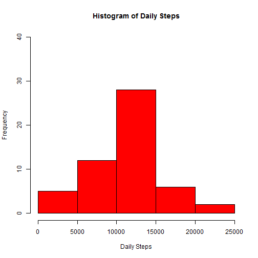
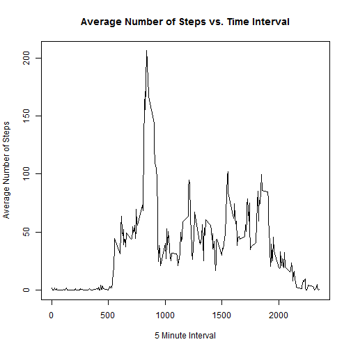
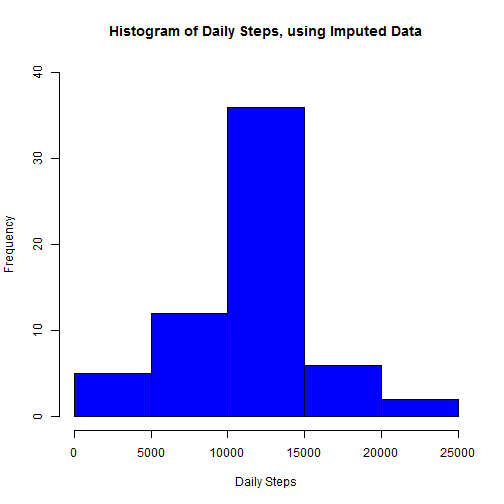
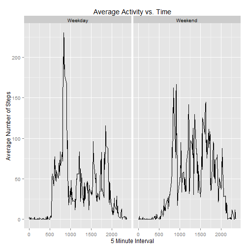

## Loading and preprocessing the data


```r
# Read in the data
fileloc <- paste0(getwd(), "/activity/activity.csv")
activity <- read.csv(fileloc, header = TRUE, na.strings = "NA", colClasses = "character")

# Convert from character strings to numeric and POSIXct values.
activity[,1] <- as.numeric(activity[,1])
activity[,2] <- as.POSIXct(activity[,2], format = "%Y-%m-%d")
activity[,3] <- as.numeric(activity[,3])
```


## What is mean total number of steps taken per day?

```r
library(dplyr)

# Remove the NA values, group by the date, and then find the sum of the steps by date
clean_steps <- activity[is.na(activity$steps) == FALSE,]
total_steps <- clean_steps %>% group_by(date) %>% summarise_each(funs(sum), steps)

# Make the histogram
hist(x = total_steps$steps, col = "red", main = "Histogram of Daily Steps", xlab = "Daily Steps", ylim = c(0, 40))
```

 


```r
# Convince R to give the below output without using scientific notations.
options(scipen = 2)

# Compute the mean number of steps per day
mean_steps <- mean(total_steps$steps, na.rm = TRUE)

# Compute the median number of steps per day
median_steps <- median(total_steps$steps, na.rm = TRUE)
```
* The mean number of steps per day was 10766.1886792.  
* The median number of steps per day was 10765.

## What is the average daily activity pattern?

```r
# Group the data by the time interval and take the average number steps.
avg_activity <- clean_steps %>% group_by(interval) %>% summarise_each(funs(mean), steps)

# Create a time series plot of the average number of steps taken in a given interval.
plot(x = avg_activity, type = "l", main = "Average Number of Steps vs. Time Interval", xlab = "5 Minute Interval", ylab = "Average Number of Steps")
```

 

```r
# Find the index of the interval with the maximum average activity.
max_interval <- which.max(avg_activity$steps)
```
* The highest activity interval is 835.


## Imputing missing values

```r
num_nas <- sum(is.na(activity$steps))
```

* The number of NAs in the dataset is 2304.  
* Determine if the NAs encompass the entire day when they occur:


```r
# Separate the NA rows from the activity data set.
na_data <- filter(activity, is.na(steps))
na_free <- filter(activity, !is.na(steps))

overlap <- na_free$date %in% na_data$date
```
* There are 0 matches between the two data sets.  
* This indicates that in every case the NAs indicate for missing days.  
* Therefore, my strategy is going to be to use the average for the five minute intervals to impute the NAs.  


```r
# Construct a data frame to match average interval step values to each NA
linker <- data.frame(0:2355, rep(0, times = 2356))
colnames(linker) <- c("interval", "avg_steps")
linker[avg_activity$interval + 1, 2] <- avg_activity$steps

# overwrite the NA values
na_data <- mutate(na_data, steps = linker[interval + 1, 2])

# Merge the data franes conntaining the filled NAs and the complete data
activity_imputed <- rbind(na_data, na_free)
```

* Now we need to compare the results of using the imputed data to the original analysis.


```r
# Make the total steps histogram using the imputed data
total_steps_imputed <- activity_imputed %>% group_by(date) %>% summarise_each(funs(sum), steps)

hist(x = total_steps_imputed$steps, col = "blue", main = "Histogram of Daily Steps, using Imputed Data", xlab = "Daily Steps", ylim = c(0,40))
```

 

```r
# Compute the mean and median of the daily steps, using the imputed data
mean_steps_imputed <- mean(total_steps_imputed$steps)
median_steps_imputed <- median(total_steps_imputed$steps)
```

* The mean number of steps is 10766.1886792 when computed from the imputed data, vs. 10766.1886792 computed using data with the NAs omitted.  
* The median number of steps is 10766.1886792 when computed from the imputed data, vs. 10765 computed using data with the NAs omitted.  
* From these comparisons, I surmise that using imputed data had a minimal effect on our estimates of the total no. of steps.  

## Are there differences in activity patterns between weekdays and weekends?

* First, we need to split the data into weekdays and weekends.  


```r
# Add a new column to the activity data to indicate the day of the week.
activity_imputed <- mutate(activity_imputed, week_part = weekdays(date))

# Turn the day names into a factor variable
activity_imputed[activity_imputed$week_part %in% c("Monday", "Tuesday", "Wednesday", "Thursday", "Friday"), 4] <- 1

activity_imputed[activity_imputed$week_part %in% c("Sunday", "Saturday"), 4] <- 2

activity_imputed$week_part <- factor(x = activity_imputed$week_part, levels = c("1","2"), labels = c("Weekday", "Weekend"))
```

* With this factor, we can determine the average activity vs. time separated by whether the data was collected during the week or not.  


```r
# Import the qplot library
library(ggplot2)

# Find the average steps per interval split by weekdays and weekends.
avg_by_week_part <- activity_imputed %>% group_by(week_part, interval) %>% summarise_each(funs(mean), steps)

# Make a time series plot for the weekday and weekend average data.
qplot(x = avg_by_week_part$interval, y = avg_by_week_part$steps, data = avg_by_week_part, facets = . ~ week_part, geom = "line", main = "Average Activity vs. Time", xlab = "5 Minute Interval", ylab = "Average Number of Steps")
```

 
